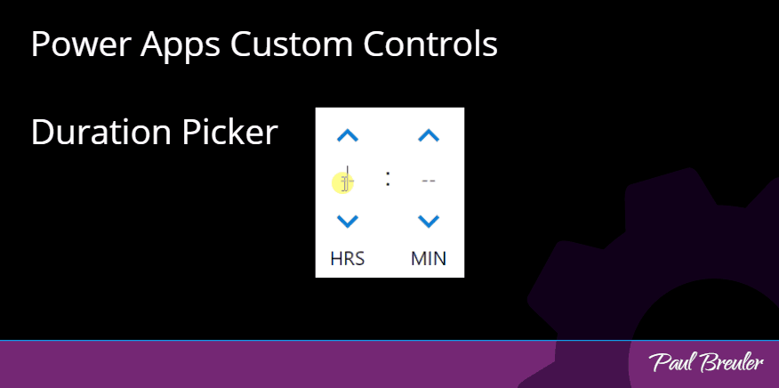

Posted on PCF Gallery at https://pcf.gallery/duration-picker/. 

# Duration Picker
A react based duration picker that allows users to enter hours and minutes manually, by clicking the chevrons or manually entering time up to 24 hours.

Accepted input events:
 - Manual text entry (digits only)
 - Click
 - Click and hold
 - Click space bar or enter key while focused a chevron element
 - Hold space bar or enter key while focused a chevron element
 
 Holding will cause the increment/decrement action to accelerate. 

## How to test locally
1. Run `npm i` to install all node modules.
2. Run `npm run build` to build the project
3. Run `npm start` to test things out.

## How to install
 - Grab a copy from the [releases section](https://github.com/paulbreuler/PCF-Controls/releases)
 - If you choose to fork this repo and modify the code reference the Microsft Docs [import custom controls](https://docs.microsoft.com/en-us/powerapps/developer/component-framework/import-custom-controls) article.
- **Please note, at the time of publication PCFs do not support Duration type fields, this control is bound to a whole number field.**
  - Reference: [Elements that are not supported](https://docs.microsoft.com/en-us/powerapps/developer/component-framework/manifest-schema-reference/property#value-elements-that-are-not-supported)
